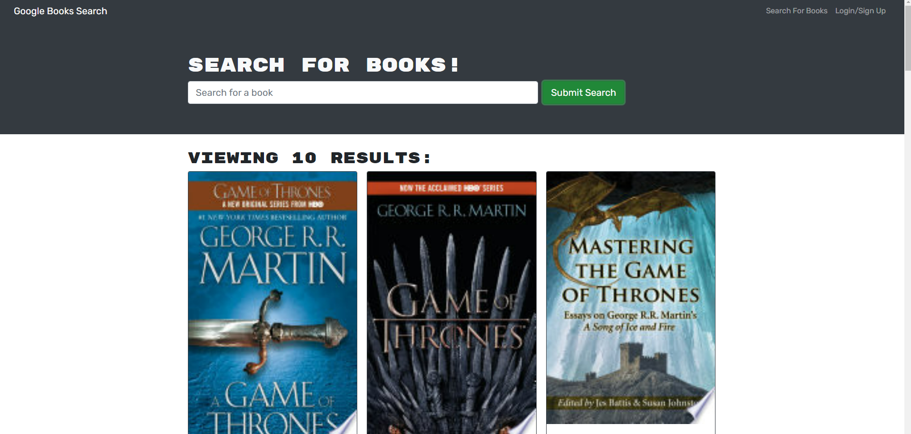

# Book-Search-Engine

Hello and welcome to the Book Search!

You can use the website to search for info on any book using Google's Book Search API.

The application can be run locally by cloning the Github repository to your machine, installing all of the dependencies with 'npm install', and then using "npm start", or it can be found online [here](https://damp-beyond-91564.herokuapp.com/)

Here is a screenshot: 

